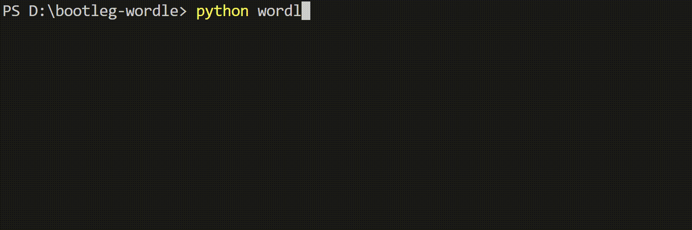
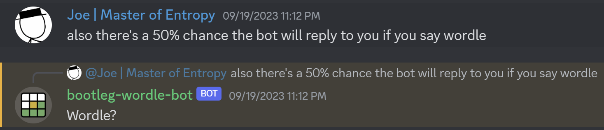

# Bootleg Wordle

## A bootleg recreation of Wordle, along with a multiplayer mode and an automatic solver

Have you ever played the word game Wordle and thought, "hey, there probably is a mathematically optimal way to choose which word to guess based on previous guesses and their outputs"?  

No? Fine, but I have. And that thought led to this repo!  

---

### Ranking Algorithms

I downloaded the dictionary Wordle uses from [here](https://gist.github.com/scholtes/94f3c0303ba6a7768b47583aff36654d), and wrote two algorithms to rank every valid word in the dictionary by how optimal it is as a guess.  

The first algorithm assigns a value (1~26) to the 26 letters, by the amount of times they appear in words in the dictionary that makes up all possible Wordle answers. The score of a word is calculated by adding all the scores of individual letters up, while applying an exponential decay to repeating letters to discourage them from wasting space for guessing more letters. For example, the second time the same letter appears in a word, its score gets divided by 2; the third time it appears, its score gets divided by 4, and so on. This makes the algorithm suggest words with the most unique, common letters.  

The second algorithm focuses on the game itself. For every guess, Wordle has a total of $` 3^5=243 `$ outcomes based on its color. For every outcome, the list of still possible words gets reduced to a certain amount, easily calculated by code. Therefore, for all the 243 outcomes, we have a mapping of all possible answers to all outcomes. To determine whether this guess is effective or not, we randomly choose one word from the dictionary to be the answer, deduce the outcome of the guess, and calculate the number of words still possible that satisfies this outcome. The smaller this expected number of words is, the more effective the guess is, since the more the guess narrows the number of possible words. An ineffective guess, therefore, should have a large variation in its 243 outcomes.  
For an extreme example, let's say we invent a 27th letter, "@", and trick Wordle into accepting that "@@@@@" is somehow a valid word. If we use "@@@@@" as a guess, it is obvious that no matter which word is the answer, the outcome will always come out to be ⬜⬜⬜⬜⬜ - the number of still possible words does not get narrowed down at all, and this "guess" is an extremely ineffective one.  

To calculate how effective a guess is in general, we then calculate the standard deviataion of the 243 outcomes as a metric of how much variation there is among them. A higher variation means more varied outcomes, and an ineffective guess, and vice versa. We then calculate this score for every guessable word in the dictionary - around twelve thousand words - and rank them. (This takes quite a lot of time due to how computationally complex this is, and even with multiprocessing and a pretty darn good CPU, it took 9 minutes to run.)

---

### Terminal-line Program Functionalities

- `calc_score.py` takes the two dictionaries as input and, for each word, calculates the scores with both algorithms, as well as its frequency in the English language - a gauge on how difficult the word would be to guess. It then stores all the data in `scores.csv`.  

- ``wordle_core.py`` and ``utils.py`` provide useful code for comparing two words and outputting the colors using emojis, getting a list of still valid words for a certain guess and outcome, and accessing data like the scores and frequnecies of a word from the CSV file.

- `wordle_singleplayer.py` and `wordle_multiplayer.py` provide a recreation of Wordle, where the singleplayer version chooses an answer at random, and the multiplayer version sets the answer from a terminal input - from your friend, for example. If you have any.  

- `wordle_help.py` is basically a cheat for any Wordle game, official or otherwise. Using an algorithm of your choice, the program provides suggestions for optimal guesses for your consideration for each step along the way. It needs each of your guesses and each outcome from the game as inputs.

- `wordle_solver.py` solves a Wordle game with your input as the answer, using an algorithm of your choice.

---

### Discord bot

I wrote all of these functionalities, and more, into a Discord bot! The bot is being regularly maintained and updated, and hosted on my very own home PC. Due to the nature of me being an undergrad college student, the bot may go offline unexpectedly, but I will try to keep it up for as long as I can. Add it to your server [here](https://discord.com/oauth2/authorize?client_id=1153245754207518820&permissions=68608&scope=bot).

If you find any bugs in the bot at any point, which I am certain there will be a fair amount of, or have ideas and suggestions towards the bot, feel free to contact me here on GitHub, or [add me on Discord](discordapp.com/users/803676742639550544).

#### Bot Commands

- `$play-wordle` starts a singleplayer Wordle game between you and the bot. You can select a difficulty between easy, medium, hard and random - determined by the aformentioned word frequency - and have five guesses (ten on hard mode, because I play nice) to determine the answer.  

- `$solve-wordle` functions similarly to `wordle_help.py`, as a cheat for any external Wordle game.

- `$challenge-wordle` challenges the bot to a Wordle game with your input. Functions similarly to `wordle_solver.py`.

- And more to come, perhaps!

During any session, you can type `!quit` to quit the current session. A session will time out after 10 minutes of receiving no valid response.  

## Have fun!  
